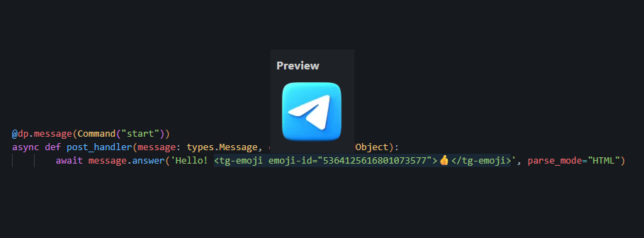

# Telegram Emoji Preview for VS Code

**Read this in:** [🇺🇦 Українською](README.uk.md) · [Русский](README.ru.md)  
**Contact:** https://t.me/syumer

## Preview



This extension lets you preview Telegram custom emojis directly in VS Code. Hover the tag (specifically `emoji-id`) to see the image.

Hover `emoji-id` to preview the emoji.

## ⚙️ Setup

The extension requires a Telegram bot token (Telegram API doesn’t provide file URLs without a token).

1. **Create a bot (or use an existing one):**
   - Message [@BotFather](https://t.me/BotFather) in Telegram
   - Send `/newbot` and follow the steps
   - Copy the **API Token**

2. **Add the token in VS Code:**
   - Open Settings: `Ctrl + ,` (or `Cmd + ,` on macOS)
   - Search for: `telegram`
   - Find **Telegram Emoji Preview: Bot Token**
   - Paste your token there

## 🚀 Usage

The extension works with `<tg-emoji>` tags (the standard HTML format used by Telegram bots).

Example:

```python
await message.answer(
    'Hello <tg-emoji emoji-id="5368324170671202286">👍</tg-emoji>',
    parse_mode="HTML"
)
